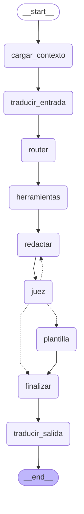

# Grafo del agente (agente_unico)

Generado con `app.get_graph().draw_mermaid()` de LangGraph.

```mermaid
---
config:
  flowchart:
    curve: linear
---
graph TD;
	__start__([<p>__start__</p>]):::first
	cargar_contexto(cargar_contexto)
	traducir_entrada(traducir_entrada)
	traducir_salida(traducir_salida)
	router(router)
	redactar(redactar)
	juez(juez)
	plantilla(plantilla)
	finalizar(finalizar)
	herramientas(herramientas)
	__end__([<p>__end__</p>]):::last
	__start__ --> cargar_contexto;
	cargar_contexto --> traducir_entrada;
	finalizar --> traducir_salida;
	herramientas --> redactar;
	juez -.-> finalizar;
	juez -.-> plantilla;
	juez -.-> redactar;
	plantilla --> finalizar;
	redactar --> juez;
	router --> herramientas;
	traducir_entrada --> router;
	traducir_salida --> __end__;
	classDef default fill:#f2f0ff,line-height:1.2
	classDef first fill-opacity:0
	classDef last fill:#bfb6fc

```
