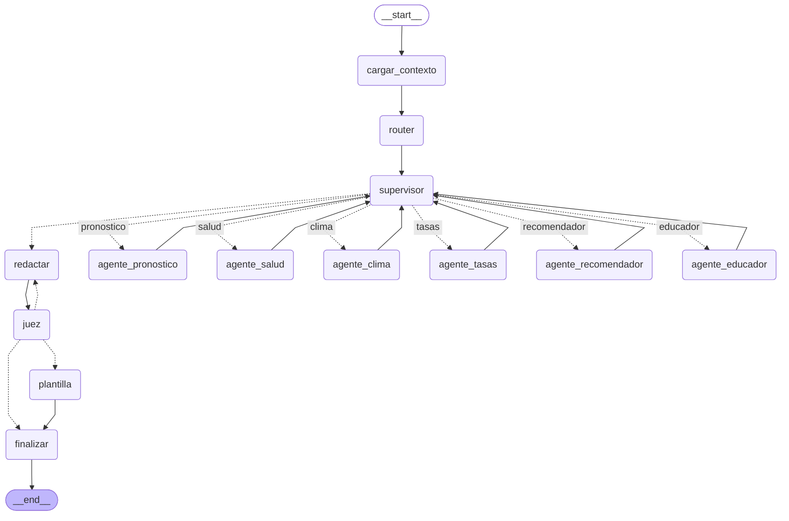

# Grafo del agente (multiagente)

Generado con `app.get_graph().draw_mermaid()` de LangGraph.

```mermaid
---
config:
  flowchart:
    curve: linear
---
graph TD;
	__start__([<p>__start__</p>]):::first
	cargar_contexto(cargar_contexto)
	router(router)
	redactar(redactar)
	juez(juez)
	plantilla(plantilla)
	finalizar(finalizar)
	supervisor(supervisor)
	agente_pronostico(agente_pronostico)
	agente_salud(agente_salud)
	agente_clima(agente_clima)
	agente_tasas(agente_tasas)
	agente_recomendador(agente_recomendador)
	agente_educador(agente_educador)
	__end__([<p>__end__</p>]):::last
	__start__ --> cargar_contexto;
	agente_clima --> supervisor;
	agente_educador --> supervisor;
	agente_pronostico --> supervisor;
	agente_recomendador --> supervisor;
	agente_salud --> supervisor;
	agente_tasas --> supervisor;
	cargar_contexto --> router;
	juez -.-> finalizar;
	juez -.-> plantilla;
	juez -.-> redactar;
	plantilla --> finalizar;
	redactar --> juez;
	router --> supervisor;
	supervisor -. &nbsp;clima&nbsp; .-> agente_clima;
	supervisor -. &nbsp;educador&nbsp; .-> agente_educador;
	supervisor -. &nbsp;pronostico&nbsp; .-> agente_pronostico;
	supervisor -. &nbsp;recomendador&nbsp; .-> agente_recomendador;
	supervisor -. &nbsp;salud&nbsp; .-> agente_salud;
	supervisor -. &nbsp;tasas&nbsp; .-> agente_tasas;
	supervisor -.-> redactar;
	finalizar --> __end__;
	classDef default fill:#f2f0ff,line-height:1.2
	classDef first fill-opacity:0
	classDef last fill:#bfb6fc

```
